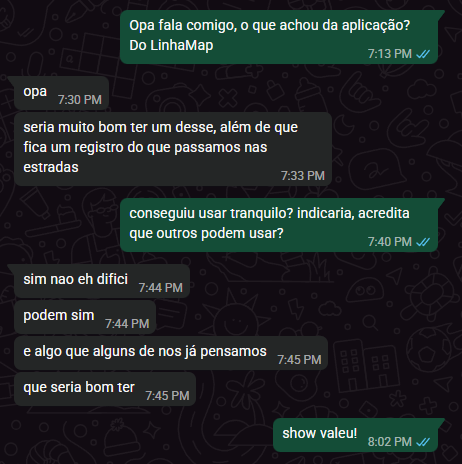

# Roteiro de Slides — LinhaMap (apresentação 26/06)

> **Categoria:** Desafio Empresa e Comunidade · **Proponente:** QUANYX Tecnologia
> **Equipe:** 3 Hacketeers — Armando Giordani Trassi, Leandro Pires de Moraes Filho, Pedro Felipe Vieira Gouveia
> **MVP:** https://linha-map.vercel.app

**Como usar:** cada slide tem **[NO SLIDE]** (texto curto/visual que aparece) e **[FALA]** (o que
você narra). Regra: **slide com pouco texto**, a explicação fica na sua boca. Total ~14 slides,
~6 min de fala + demo ao vivo. A demo (slides 6–9) é o coração — mostre o **MVP rodando**.

---

## Slide 1 — Capa
**[NO SLIDE]**
- Logo **LinhaMap** 🛰️🌧️🚜
- _"Estrada aberta o ano todo: previsão de risco para as linhas vicinais de Ariquemes."_
- Equipe: 3 Hacketeers · Categoria: Empresa e Comunidade · Proponente: QUANYX
- (rodapé) https://linha-map.vercel.app

**[FALA]** "Somos a equipe 3 Hacketeers e esse é o LinhaMap — uma solução pro desafio da QUANYX
Tecnologia: manter as estradas de Ariquemes trafegáveis no inverno amazônico."

---

## Slide 2 — O problema
**[NO SLIDE]**
- Foto/charge de **caminhão atolado em estrada de terra**.
- 3 palavras grandes: **CHUVA → LAMA → PREJUÍZO**
- _"Hoje a manutenção é reativa: só conserta depois do atolamento."_

**[FALA]** "Toda estação chuvosa, as linhas vicinais viram lama. O leite azeda, o peixe e o café
não saem. E a prefeitura só descobre **depois** que o caminhão já atolou."

---

## Slide 3 — Quem sofre (público + relevância)
**[NO SLIDE]**
- Ícones: 🥛 produtor de leite · 🐟 piscicultor · 🚛 transportador · 🏛️ Secretaria de Obras
- _"Problema real, trazido por uma empresa (QUANYX) — nas Linhas C-65 e C-70."_

**[FALA]** "Quem sofre são produtores, transportadoras, cooperativas e a própria Secretaria, que
não tem dados pra priorizar. É um problema **real e local** — base da nossa extensão."

---

## Slide 4 — A solução em uma frase
**[NO SLIDE]**
- **LinhaMap** — _"Um Índice de Trafegabilidade de 0 a 100 por trecho, com até 7 dias de antecedência."_
- 4 ícones de entrada: 🌧️ chuva · 📈 previsão · ⛰️ declividade · 🗣️ relatos

**[FALA]** "O LinhaMap cruza chuva acumulada, previsão, declividade e os relatos da comunidade e
gera um índice de risco por trecho — antecipando o bloqueio em até 7 dias. Manutenção
**preventiva**, não reativa."

---

## Slide 5 — Como funciona (explicável, não caixa-preta)
**[NO SLIDE]**
- Fórmula visual com pesos: **Chuva 72h 30% · Previsão 7d 25% · Declividade 15% · Relatos 30%**
- Faixas: 🟢 0–24 · 🟡 25–49 · 🟠 50–74 · 🔴 75–100
- _"O sistema diz o PORQUÊ do risco."_

**[FALA]** "Não é caixa-preta: cada fator tem um peso, e o sistema gera uma **explicação em texto**
do motivo de um trecho estar crítico. Transparente pra banca e pra Secretaria."

---

## Slide 6 — DEMO ① Mapa de risco
**[NO SLIDE]**
- Print do **mapa** com trechos coloridos + painel do **Ponte do Branco (C-65, crítico)**.
- Etiqueta: **▶ DEMO AO VIVO**

**[FALA]** _(abrir `linha-map.vercel.app/mapa`)_ "Cada linha é colorida por risco. Clico no Ponte
do Branco, na C-65: índice, chuva, declividade, relatos e a explicação do porquê — tudo aqui."

---

## Slide 7 — DEMO ② Denúncia + IA
**[NO SLIDE]**
- Print do **formulário de denúncia** → tela de **sucesso com categoria classificada**.
- _"O produtor relata; a IA classifica; o risco se atualiza."_

**[FALA]** _(abrir `/denuncia`)_ "O produtor descreve o problema e toca em 'usar minha
localização'. Ao enviar, a **IA (Claude)** classifica a categoria e a gravidade sozinha."

---

## Slide 8 — DEMO ③ ★ Denúncia por WhatsApp + offline (diferencial)
**[NO SLIDE]**
- Print do **WhatsApp** com `linhamap-hackathon ...` → resposta do bot.
- Selo: **sem precisar do app** · **funciona offline (PWA)**

**[FALA]** _(mostrar no celular)_ "E o diferencial: o produtor **nem precisa do app**. Ele
denuncia pelo **WhatsApp**, do jeito que já usa. E se estiver **sem sinal** na estrada, o app
guarda e envia sozinho quando a internet volta."

---

## Slide 9 — DEMO ④ Dashboard da Secretaria
**[NO SLIDE]**
- Print do **dashboard** (mapa de calor + trechos prioritários) e do **relatório semanal**.
- _"Decisão com dados + documento pronto pra ofício."_

**[FALA]** _(abrir `/dashboard` e `/relatorios`)_ "Do outro lado, a Secretaria vê o mapa de calor,
os trechos prioritários, exporta CSV e já tem um **relatório semanal** pronto pra ata."

---

## Slide 10 — Diferenciais
**[NO SLIDE]**
- 4 bullets curtos: **Explicável** · **Acessível (WhatsApp + offline)** · **Robusto (fallback/demo)** · **Pronto p/ gestão pública**

**[FALA]** "Resumindo o que nos diferencia: é explicável, é acessível pra quem vive a estrada,
não quebra (tem fallback) e já entrega valor pra gestão pública."

---

## Slide 11 — Uso de Inteligência Artificial
**[NO SLIDE]**
- **Claude (Anthropic)** → classifica denúncia + redige relatório (com fallback por regras)
- **Claude Code** → apoio a código, documentação e testes
- _"Equipe revisou, testou e adaptou. Nenhuma credencial exposta."_

**[FALA]** "Usamos IA de forma transparente: o Claude classifica as denúncias e apoiou o
desenvolvimento. A equipe revisou e testou tudo — a declaração completa está no GitHub."

---

## Slide 12 — O que funciona × o que ainda não
**[NO SLIDE]**
- Duas colunas: **✅ Funciona** (mapa, denúncia web/WhatsApp/offline, IA, dashboard, chuva real)
  · **🔧 A melhorar** (declividade curada, modelo preditivo, foto no Storage)

**[FALA]** "Sendo honestos: o que funciona hoje é todo o fluxo ponta a ponta, online. O que
queremos evoluir é a declividade real e um modelo preditivo com histórico."

---

## Slide 13 — Validação
**[NO SLIDE]**
- _"Desafio real (QUANYX) · iteração após feedback → tela /resumo em linguagem leiga"_
- 

**[FALA]** "O problema veio de uma empresa real. E já iteramos a partir de feedback: criamos uma
tela em linguagem simples pro produtor depois de ouvir que a versão técnica confundia."

---

## Slide 14 — Encerramento
**[NO SLIDE]**
- **LinhaMap** — _"Menos prejuízo na lavoura, mais estrada aberta."_
- **QR Code** apontando pra `linha-map.vercel.app`
- "Obrigado!" + nomes da equipe

**[FALA]** "LinhaMap: uma Secretaria que age **antes** do problema e um produtor que não fica
isolado. Está no ar, é explicável e foi feito pra Ariquemes. Obrigado — podem testar pelo QR."

---

## Dicas de design (pra montar rápido no Canva/Slides)
- **Cores:** verde (#26734f, a marca) + tons de risco (verde→amarelo→laranja→vermelho).
- **1 ideia por slide**, fonte grande, **máx. ~15 palavras** de texto por slide.
- Use **prints reais do MVP** (mapa, denúncia, dashboard, WhatsApp) — provam que funciona.
- Slides 6–9 são "pano de fundo" da **demo ao vivo** — se a net cair, eles seguram sozinhos.
- Gere o **QR Code** do MVP (qualquer gerador) pro slide final — a banca testa na hora.
- Mantenha o número de slides enxuto; **tempo > quantidade de slides**.
